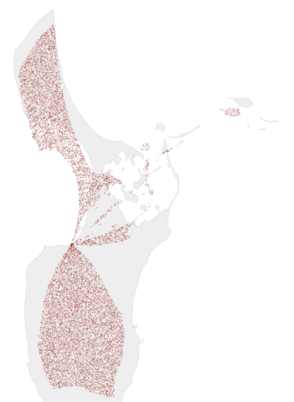

# Samsø black hole generator

Dette er et lille dumt eksperiment, der laver et sort hul på Samsø, hvor en masse punkter bliver suget ned i.

Det kan køres gennem notebook, eller det eksporterede python script.

For at generere videoen skal ffmpeg være installeret.

Hvis du ikke er på windows, skal du nok omdøbe powershell scripts til noget .sh eller andet.
